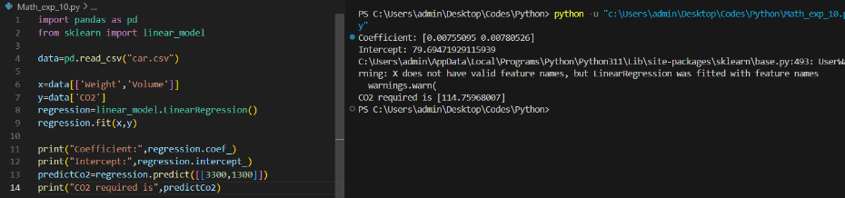

# Implementation of Multivariate Linear Regression

## Aim
To write a python program to implement multivariate linear regression and predict the output.

## Equipment’s required:
1.	Hardware – PCs
2.	Anaconda – Python 3.7 Installation / Moodle-Code Runner

## Algorithm:
### Step1:
Import the required libraries pandas and sklearn.linear_model.

### Step2:
Read the data from the CSV file "car.csv" into a DataFrame using pd.read_csv().

### Step3:
Select the predictor variables ('Weight' and 'Volume') as x and the target variable ('CO2') as y.

### Step4:
Initialize a linear regression model using linear_model.LinearRegression() and fit it to the data using regression.fit(x, y).

### Step5:
Predict the CO2 emission for a given weight and volume (e.g., [[3300, 1300]]) using regression.predict() and print the coefficient, intercept, and predicted CO2 emission.

## PROGRAM:
```
'''
Developed By: SARWESHVARAN A
Reference Number: 212223230198
'''
import pandas as pd
from sklearn import linear_model

data=pd.read_csv("car.csv")

x=data[['Weight','Volume']]
y=data['CO2']
regression=linear_model.LinearRegression()
regression.fit(x,y)

print("Coefficient:",regression.coef_)
print("Intercept:",regression.intercept_)
predictCo2=regression.predict([[3300,1300]])
print("CO2 required is",predictCo2)

```
## Output:



## Result
Thus, the multivariate linear regression is implemented and predicted the output using python program.